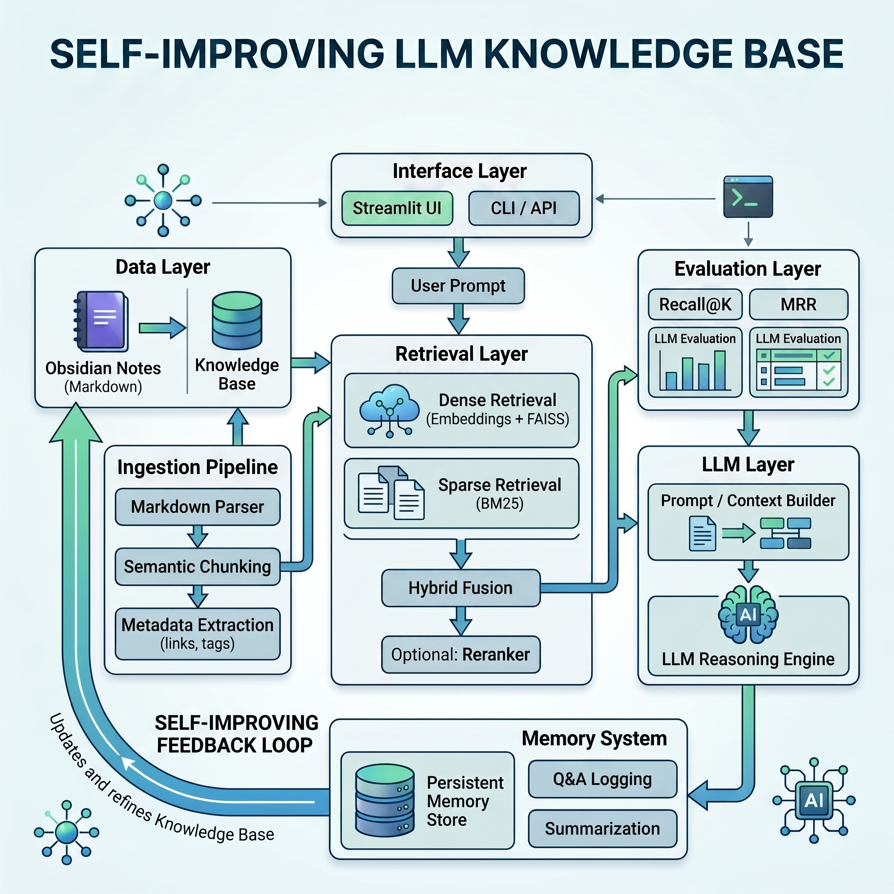

# 🧠 Self-Improving LLM Knowledge Base



[](https://github.com/sadjad6/self-improving-llm-kb/actions/workflows/ci.yml)
[](https://codecov.io/gh/sadjad6/self-improving-llm-kb)
[](https://www.python.org/downloads/)
[](LICENSE)

A RAG portfolio project with FAISS/BM25 hybrid retrieval, persistent Q&A memory, and generated summary notes. It demonstrates components for an iterative knowledge workflow; summaries are not automatically reindexed and the model does not train on interactions.

> The code is organized into ingestion, retrieval, generation, memory, and evaluation modules. Production readiness and retrieval/answer quality have not been established by a published benchmark or deployment.

---

## ✨ Key Features

| Feature | Description |
|---|---|
| 🔍 **Hybrid Retrieval** | Combines FAISS dense vectors with BM25 sparse scores via Reciprocal Rank Fusion (RRF) |
| 📄 **Markdown Chunking** | Splits Markdown at headings and paragraphs while preserving heading context |
| 🤖 **Context-Based LLM Answers** | OpenAI GPT prompt asks for context-based answers and citations; citations and factual accuracy are not independently validated |
| 🧠 **Persistent Memory** | Stores interactions, scores and deduplicates queries, and writes summaries to a separate directory; they require manual inclusion in the indexed knowledge base |
| 📊 **Evaluation Utilities** | Recall@K/MRR functions, a heuristic answer score, an LLM-judge prompt template, and optional MLflow logging; the sample dataset has no relevance labels |
| 🖥️ **Dual Interface** | Polished Streamlit web UI + Rich CLI |
| 🛡️ **Graceful Degradation** | Soft-imported ML dependencies with clear error messages instead of crashes |

---

## 🏗️ Architecture

```
  Markdown Files ──▶ Parser ──▶ Markdown Chunker ──▶ Chunks
                                                       │
                                     ┌─────────────────┤
                                     ▼                  ▼
                               FAISS Dense          BM25 Sparse
                                 Index               Index
                                     │                  │
                                     └──────┬───────────┘
                                            ▼
                                    Hybrid Retriever
                                     (RRF Fusion)
                                            │
                                            ▼
                                    LLM Reasoning
                                (context-prompted answer)
                                            │
                                            ▼
                                     Memory Store
                                (score → dedupe → prune)
                                            │
                                            ▼
                                     Summary Notes
                             (separate memory directory)
```

---

## 🚀 Quick Start

### 1. Clone & Set Up

```bash
git clone https://github.com/sadjad6/self-improving-llm-kb.git
cd self-improving-llm-kb
python -m venv .venv
source .venv/bin/activate       # Windows: .venv\Scripts\activate
pip install -r requirements.txt
```

### 2. Configure

```bash
cp .env.example .env
# Edit .env → set OPENAI_API_KEY=sk-your-key-here
```

### 3. Run

```bash
# Index the knowledge base
python cli.py ingest

# Ask a question
python cli.py ask "What is retrieval-augmented generation?"

# Launch the web UI
streamlit run app/streamlit_app.py
```

---

## 🖥️ Interfaces

### CLI (Click + Rich)

```bash
python cli.py ingest                                         # Index documents
python cli.py ask "How do transformers work?" --method hybrid # Query with method selection
python cli.py memory-stats                                   # View memory statistics
python cli.py evaluate --method hybrid                       # Run sample answer checks
```

### Streamlit Web UI

```bash
streamlit run app/streamlit_app.py
```

Features: query panel, retrieved-context viewer with scores, performance metrics, memory dashboard, and architecture overview.

---

## 📁 Project Structure

```
self-improving-llm-kb/
├── app/
│   └── streamlit_app.py          # Streamlit web dashboard
├── cli.py                        # CLI interface (Click + Rich)
├── config/
│   └── default.yaml              # All system configuration
├── data/
│   └── knowledge_base/           # Source Markdown files (5 ML topics)
├── docs/                         # Comprehensive documentation
│   ├── index.md                  # Project overview
│   ├── concepts.md               # LLM & RAG fundamentals
│   ├── architecture.md           # System design deep-dive
│   ├── setup.md                  # Installation guide
│   ├── usage.md                  # CLI & UI usage guide
│   ├── self_improving_loop.md    # Memory system explained
│   ├── evaluation.md             # Metrics & experiment tracking
│   └── api_reference.md          # Module API reference
├── src/
│   ├── ingestion/                # Markdown parser + heading/paragraph chunker
│   ├── retrieval/                # Dense (FAISS), sparse (BM25), hybrid
│   ├── llm/                      # LLM reasoning with context engineering
│   ├── memory/                   # Persistent interaction and summary store
│   ├── evaluation/               # Metrics (Recall@K, MRR) + MLflow tracker
│   ├── utils/                    # Config, data models, logging
│   └── pipeline.py               # Orchestration layer
├── tests/                        # Pytest test suite
├── requirements.txt
└── .env.example
```

---

## 🧠 How the Memory Workflow Works

1. **Store** — Each Q&A interaction is persisted with an importance score.
2. **Deduplicate** — Similar queries (Jaccard ≥ 0.85 by default) update an existing entry.
3. **Score** — New entries receive a heuristic score based on retrieved-chunk count and answer length; repeated access raises it.
4. **Summarize** — Entries scoring at least 0.6 trigger an LLM-generated Markdown note in `data/memory/summaries`.
5. **Reindex manually** — The default ingestion path is `data/knowledge_base`. Move or copy a reviewed summary there and run ingestion again if you want it included in retrieval. The pipeline does not use stored history or summary notes when answering by default.

→ [Full details in docs/self_improving_loop.md](docs/self_improving_loop.md)

---

## 📊 Evaluation

| Metric | Type | What It Measures |
|---|---|---|
| **Recall@K** | Retrieval | Fraction of relevant chunks in top-K results |
| **MRR** | Retrieval | Rank of the first relevant result |
| **Heuristic Score** | Answer | Length, word overlap with context, query-term coverage, and refusal indicator; this is not hallucination detection |
| **LLM-as-Judge prompt** | Template only | Builds a relevance/faithfulness/completeness prompt; no judge call or score is implemented |

`python scripts/evaluate.py` runs a small sample query set and can log results to **MLflow** when available. All sample `relevant_ids` sets are empty, so the script does not calculate Recall@K or MRR until relevance labels are supplied. No benchmark results are committed.

→ [Full details in docs/evaluation.md](docs/evaluation.md)

---

## ⚙️ Configuration

All parameters live in [`config/default.yaml`](config/default.yaml):

```yaml
ingestion:
  chunk_strategy: "semantic"
  chunk_max_tokens: 512
  preserve_headings: true

retrieval:
  hybrid:
    dense_weight: 0.6        # Semantic similarity weight
    sparse_weight: 0.4       # BM25 keyword weight
    top_k: 5

llm:
  model: "gpt-4o-mini"
  temperature: 0.1           # Sampling temperature

memory:
  enabled: true
  max_history: 1000
  deduplication_threshold: 0.85
```

Override with: `python cli.py --config path/to/custom.yaml ingest`

---

## 🧪 Testing

```bash
pytest tests/ -v
pytest tests/ -v --cov=src --cov-report=term-missing
```

Test coverage includes: ingestion parsing/chunking, sparse retrieval, memory store operations, configuration loading, evaluation metrics, and end-to-end pipeline integration.

---

## 🛠️ Tech Stack

| Layer | Technology |
|---|---|
| Embeddings | `sentence-transformers` (all-MiniLM-L6-v2) |
| Dense Index | FAISS |
| Sparse Search | BM25 (`rank-bm25`) |
| LLM | OpenAI GPT-4o-mini |
| Experiment Tracking | MLflow |
| CLI | Click + Rich |
| Web UI | Streamlit |
| Testing | pytest + pytest-cov |
| Config | YAML + dataclasses |

---

## 📚 Documentation

Comprehensive documentation is available in the [`docs/`](docs/) folder:

| Document | Description |
|---|---|
| [Project Overview](docs/index.md) | Features, architecture, quick start |
| [Core Concepts](docs/concepts.md) | LLMs, RAG, embeddings, vector search explained |
| [Architecture](docs/architecture.md) | Module-by-module design breakdown |
| [Setup Guide](docs/setup.md) | Installation, configuration, troubleshooting |
| [Usage Guide](docs/usage.md) | CLI commands, Streamlit UI, example workflows |
| [Memory Workflow](docs/self_improving_loop.md) | Memory scoring, dedup, summary generation |
| [Evaluation](docs/evaluation.md) | Metrics, LLM-as-Judge, MLflow tracking |
| [API Reference](docs/api_reference.md) | All classes, methods, and data models |

---

## 🙏 Acknowledgments

- **Andrej Karpathy** — for the vision of persistent memory and self-improving AI systems
- **Sentence-Transformers** — for accessible, high-quality embedding models
- **FAISS** — for blazing-fast vector similarity search
- **OpenAI** — for the GPT API powering grounded generation

---

## 📄 License

This project is licensed under the MIT License.


